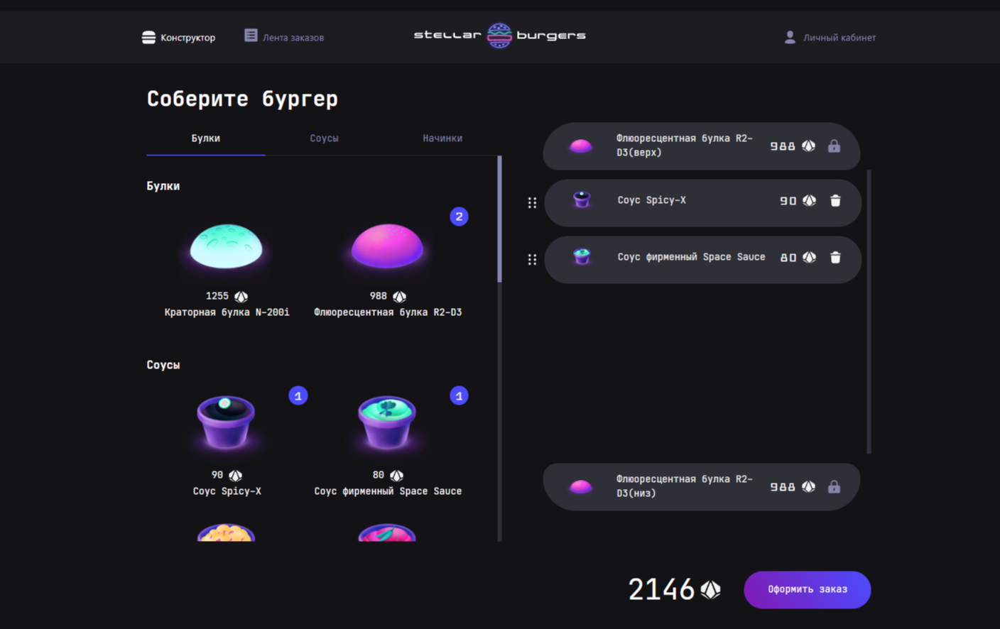

# Проект Stellar Burgers #
### Описание: ###

 Сервис космической бургерной с возможностью сборки индивидуального бургера для заказа. 

### Функциональность ###
- Регистрация и авторизация пользователя
- Сборка бургера для заказа с помощью Drag and Drop
- Выбор категории ингридиентов
- Подсчет стоимости заказа
- Получение идентификатора заказа
- Просмотр общей ленты заказов
- Личный кабинет

### Стек: ###
React, TypeScript, Redux, Redux-thunk, Websocket, Jest, Cypress

### Запуск: ###
После загрузки установите все необходимые зависимости c помощью npm install. Для запуска используйте npm start.

